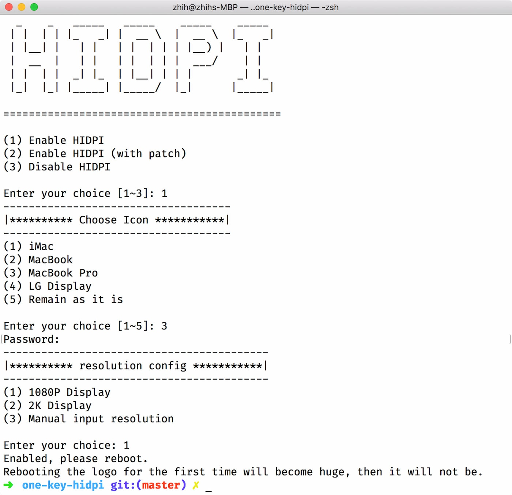

# Bật macOS HiDPI

## Giải trình

[Tiếng Anh] (README.md) | [VietNam] (README-vi.sh) | [中文] (README-zh.md)

 Tập lệnh này có thể mô phỏng macOS HiDPI trên màn hình không võng mạc và có Tỷ lệ "Gốc" trong Tùy chọn hệ thống.

Một số thiết bị gặp sự cố đánh thức, tùy chọn thứ hai của tập lệnh có thể hữu ích, nó đưa EDID được vá vào, nhưng một vấn đề khác có thể tồn tại ở đây.

Mở rộng biểu trưng có thể không được giải quyết, vì độ phân giải cao hơn là giả mạo.

Tùy chọn hệ thống: (Cập nhật sau)

## Cách sử dụng

1.Remote Mode: Chạy tập lệnh này trong Terminal

```bash
bash -c "$(curl -fsSL https://raw.githubusercontent.com/AikoCute-Offical/one-key-hidpi/master/hidpi.sh)"
```

2.Local Mode: Tải xuống ZIP, giải nén nó và nhấp đúp vào `hidpi.command` để chạy



## Sự hồi phục

### Bình thường

Vẫn chạy tập lệnh trong thiết bị đầu cuối, nhưng chọn tùy chọn 3

### Chế độ phục hồi

Nếu bạn không thể khởi động vào hệ thống hoặc gặp bất kỳ sự cố nào khác, bạn có thể khởi động vào chế độ Khôi phục macOS và sử dụng Terminal.app

Có hai cách để đóng nó. Nên chọn cái đầu tiên

1.

```bash
ls /Volumes/
```

bạn có thể thấy tất cả Đĩa.

```bash
cd /Volumes/"Your System Disk Part"/Users/

ls
```

bạn có thể thấy thư mục chính của người dùng.

```bash
cd "user name"

./.hidpi-disable
```

2.

Xóa tất cả thư mục DisplayVendorID của màn hình được chèn trong `Thư viện / Màn hình / Nội dung / Tài nguyên / Ghi đè`

```bash
ls /Volumes/
rm -rf /Volumes/"Your System Disk Part"/Library/Displays/Contents/Resources/Overrides
```

## Lấy cảm hứng

https://www.tonymacx86.com/threads/solved-black-screen-with-gtx-1070-lg-ultrafine-5k-sierra-10-12-4.219872/page-4#post-1644805

https://github.com/syscl/Enable-HiDPI-OSX